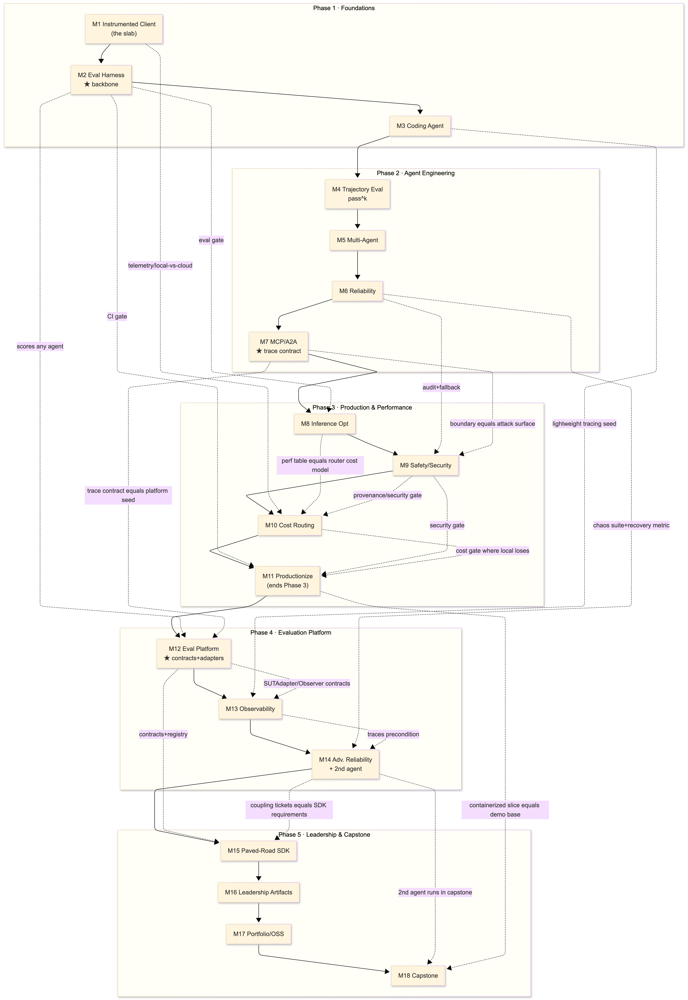

# Month-to-Month Dependency Graph

How the 18 months depend on one another. This is distilled from the main
roadmap plus each monthly lesson plan's **"Connection to prior month's spine"**
and **"Connection forward"** sections. These are the roadmap's own stated
dependencies, not invented.

**The headline:** it is essentially a **strict linear chain** - every month
*extends* the previous month's `banana` codebase, so you cannot start month N
without month N−1 complete. On top of that spine sit a handful of **long-range
reuse dependencies** (a month reaching back to a non-adjacent month's artifact),
plus **Month 2's eval harness, which is the backbone reused by nearly every
later month.**

---

## Rendered graph

The image above is a rendered snapshot for quick reading. The Mermaid source
below stays in the document so the graph can be reviewed and updated in text.

## Dependency table

| Month | Hard prerequisite (extends) | Key long-range reuse it pulls from |
|-------|------------------------------|-------------------------------------|
| **M1** Instrumented Client | - (the slab) | - |
| **M2** Eval Harness | M1 (calls `client.complete()`) | - |
| **M3** Coding Agent | M1 + M2 (agent = loop of M1 calls, scored by M2) | - |
| **M4** Trajectory Eval | M3 | M2 harness (extended to score the path) |
| **M5** Multi-Agent | M4 | M3 single-agent baseline (the bar to beat) |
| **M6** Reliability | M5 | M4 compounding-error math |
| **M7** MCP/A2A | M6 | M5 handoffs, M6 idempotency/audit become protocol guarantees |
| **M8** Inference Opt | M7 (agnostic harness measures perf) | M1 telemetry, **M2 eval as the gate** |
| **M9** Safety/Security | M8 | **M7 MCP boundary** as the attack surface, M6 audit+fallback, M2 harness |
| **M10** Cost Routing | M9 | M8 perf table (router cost model), M6 fallback, M9 provenance gate, M2 |
| **M11** Productionize | M10 | M9 security-gate, M10 cost-gate, M2/M4 failures (fine-tune data), M8 profiler |
| **M12** Eval Platform | M11 (consolidates CI/packaging) | **M7 agent-agnostic trace format + adapters** (the platform seed) |
| **M13** Observability | M12 (implements the `Observer` contract) | **M3 lightweight tracing** (productionizes the homegrown spans into OTel→Langfuse), M2 eval (drift watches its output) |
| **M14** Adv. Reliability + 2nd agent | M13 (traces are the precondition) | M6 chaos suite/recovery metric, M12 external-agent proof |
| **M15** Paved-Road SDK | M14 (coupling tickets = requirements) | M12 contracts + registry |
| **M16** Leadership Artifacts | M15 (SDK is the evidence) | M2 measurement discipline |
| **M17** Portfolio/OSS | M16 (takes artifacts public) | - |
| **M18** Capstone | M17 | **everything 1–17**; runs M14's 2nd agent, ships M15 SDK, **builds the public demo on M11's containerized deploy slice** |

---

## Two cross-cutting truths the graph encodes

- **Month 2 is the keystone.** Its eval harness is re-run to verify every
  improvement claim in M3, M4, M8, M9, M10, M11, M12, M13, M14, M15. Skip or
  under-build M2 and every later "it got better" becomes an unverifiable opinion.
- **Month 7 is where the project stops being tied to only your own agent.**
  In Month 7, the harness learns to evaluate an agent you did not build by
  reading a shared trace format through an adapter. That same idea becomes the
  core of Month 12: the platform can support any agent because each agent only
  has to translate its run into the shared format. Without this Month 7 work,
  Month 12 would still be a tool for `banana` only, not an agent-agnostic
  evaluation platform.
